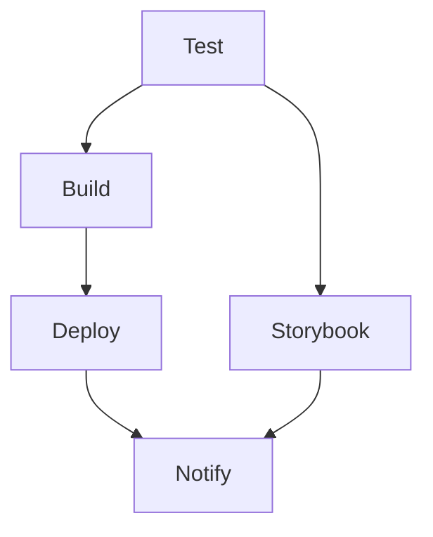

# CI/CD Pipeline Setup

This document outlines the Continuous Integration and Continuous Deployment (CI/CD) pipeline configuration for the Moisture Mapping System.

## Pipeline Overview

Our CI/CD pipeline consists of several stages:

1. **Test Stage**
   - Type checking
   - Linting
   - Unit tests
   - Storybook build verification
   - E2E tests with Cypress

2. **Build Stage**
   - Next.js production build
   - Artifact creation

3. **Deploy Stage**
   - Vercel deployment
   - Storybook deployment to Chromatic

4. **Notification Stage**
   - Slack notifications for deployment status

## Required Secrets

The following secrets need to be configured in GitHub repository settings:

### Vercel Deployment
```
VERCEL_TOKEN=xxx           # Vercel API token
VERCEL_ORG_ID=xxx         # Vercel organization ID
VERCEL_PROJECT_ID=xxx     # Vercel project ID
```

### Storybook/Chromatic
```
CHROMATIC_PROJECT_TOKEN=xxx  # Chromatic project token
```

### Slack Notifications
```
SLACK_BOT_TOKEN=xxx        # Slack bot token for notifications
```

## Setting Up Secrets

1. Go to your GitHub repository settings
2. Navigate to "Secrets and variables" → "Actions"
3. Click "New repository secret"
4. Add each required secret

## Getting Required Values

### Vercel
1. Install Vercel CLI: `npm i -g vercel`
2. Run: `vercel login`
3. Run: `vercel link` in project directory
4. Find values in `.vercel/project.json`

### Chromatic
1. Install Chromatic: `npm install --save-dev chromatic`
2. Run: `npx chromatic --project-token <your-token>`
3. Token will be provided in Chromatic dashboard

### Slack
1. Create a Slack App in your workspace
2. Enable "Incoming Webhooks"
3. Install app to workspace
4. Copy Bot User OAuth Token

## Pipeline Triggers

The pipeline is triggered on:
- Push to main branch
- Pull requests to main branch

## Job Dependencies



## Local Testing

Before pushing, you can run the same checks locally:

```bash
# Install dependencies
npm ci

# Run all checks
npm run typecheck
npm run lint
npm test
npm run build-storybook
npm run test:e2e

# Build
npm run build
```

## Monitoring

- GitHub Actions dashboard for pipeline status
- Vercel dashboard for deployment status
- Chromatic dashboard for Storybook status
- Slack #deployments channel for notifications

## Troubleshooting

Common issues and solutions:

1. **Build Failures**
   - Check TypeScript errors
   - Verify all dependencies are installed
   - Check for environment variables

2. **Test Failures**
   - Run tests locally
   - Check Cypress dashboard for E2E failures
   - Verify test environment setup

3. **Deployment Failures**
   - Verify Vercel configuration
   - Check deployment logs
   - Validate environment variables

## Support

For issues with:
- Pipeline configuration: Check GitHub Actions logs
- Vercel deployment: Contact Vercel support
- Storybook deployment: Check Chromatic documentation
- Slack notifications: Verify bot permissions

## Future Improvements

Planned enhancements:
- [ ] Add performance monitoring
- [ ] Implement automated security scanning
- [ ] Add visual regression testing
- [ ] Implement automated changelog generation
- [ ] Add deployment previews for PRs
