# MeasurementSystem Architecture Guide

This guide provides an overview of the MeasurementSystem's architecture, component relationships, and data flow.

## System Overview

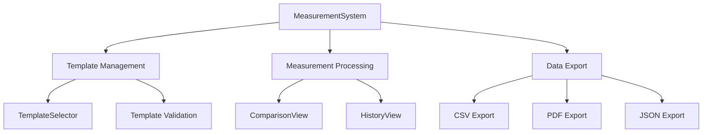

## Component Architecture

### Core Components

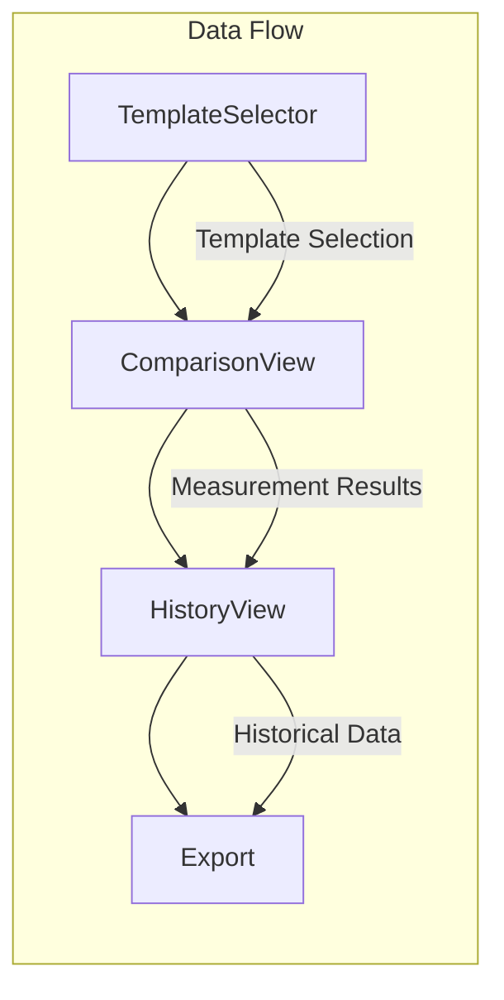

### Data Flow

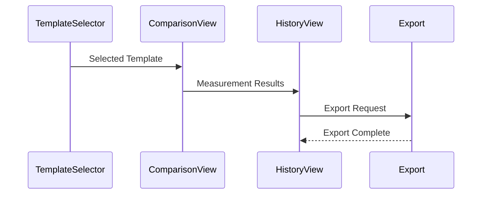

## Component Relationships

### Template Management

The template management system handles the creation, selection, and validation of measurement templates.

```typescript
// Component Hierarchy
interface TemplateManagement {
  TemplateSelector: {
    search: () => void;
    filter: () => void;
    select: (templateId: string) => void;
  };
  TemplateValidation: {
    validate: (template: unknown) => boolean;
    sanitize: (template: Template) => Template;
  };
}
```

### Measurement Processing

The measurement processing system handles data collection, comparison, and analysis.

```typescript
// Data Flow
interface MeasurementProcessing {
  input: {
    template: MeasurementTemplate;
    readings: Reading[];
  };
  processing: {
    compare: () => Comparison[];
    analyze: () => Analysis;
  };
  output: {
    results: MeasurementResults;
    summary: MeasurementSummary;
  };
}
```

## State Management

### Component State

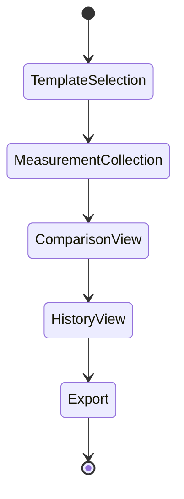

### Data State

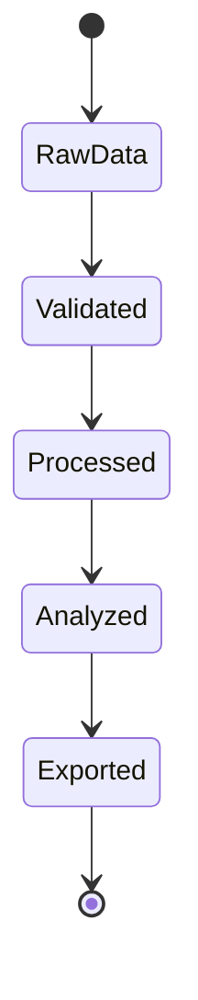

## Module Dependencies

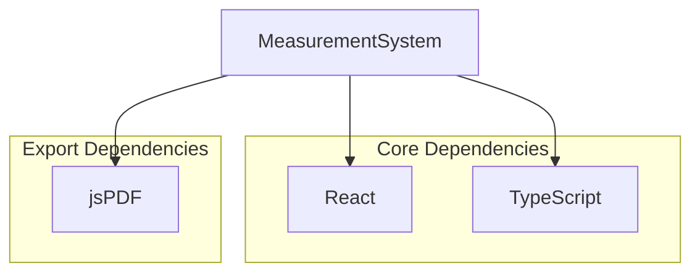

## Directory Structure

```
components/
└── MoistureMappingSystem/
    └── MeasurementSystem/
        ├── components/           # React components
        │   ├── TemplateSelector/
        │   ├── ComparisonView/
        │   └── HistoryView/
        ├── utils/               # Utility functions
        │   ├── validation.ts
        │   ├── export.ts
        │   └── analysis.ts
        ├── types/               # TypeScript types
        │   ├── templates.ts
        │   ├── measurements.ts
        │   └── export.ts
        └── __tests__/          # Test files
```

## Data Models

### Template Model

```typescript
interface Template {
  id: string;
  name: string;
  description: string;
  points: Point[];
  gridSpacing: number;
  referenceValues: {
    dry: number;
    warning: number;
    critical: number;
  };
}
```

### Measurement Model

```typescript
interface Measurement {
  sessionId: string;
  templateId: string;
  timestamp: Date;
  readings: Reading[];
  comparisons: Comparison[];
  summary: {
    averageDeviation: number;
    maxDeviation: number;
    pointsOutOfTolerance: number;
  };
}
```

## Communication Flow

### Internal Communication

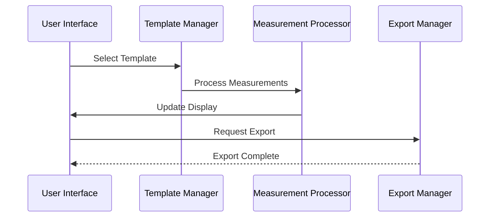

### External Communication

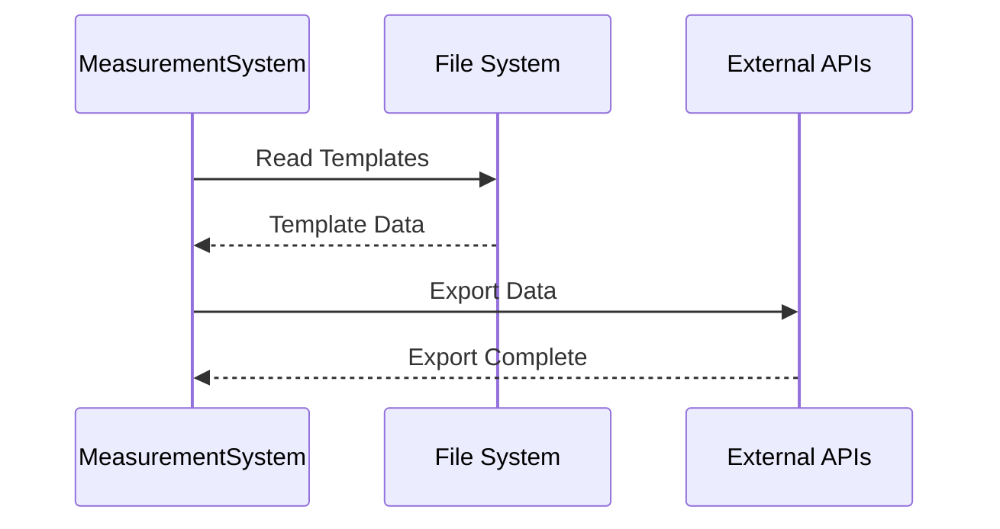

## Performance Considerations

### Component Optimization

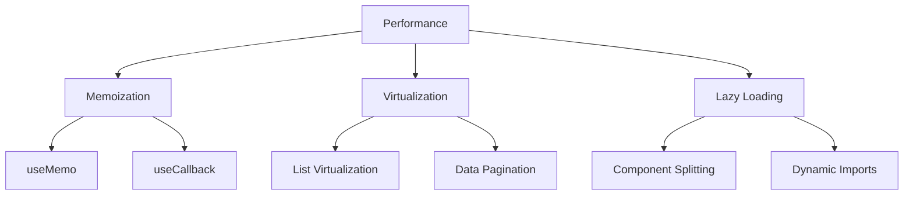

### Data Flow Optimization

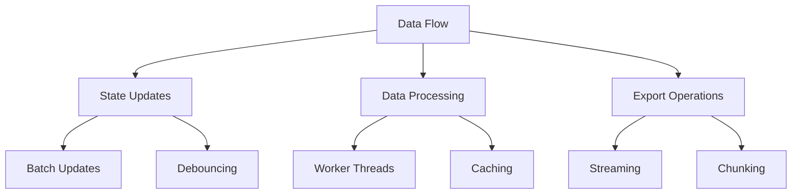

## Security Considerations

### Data Validation

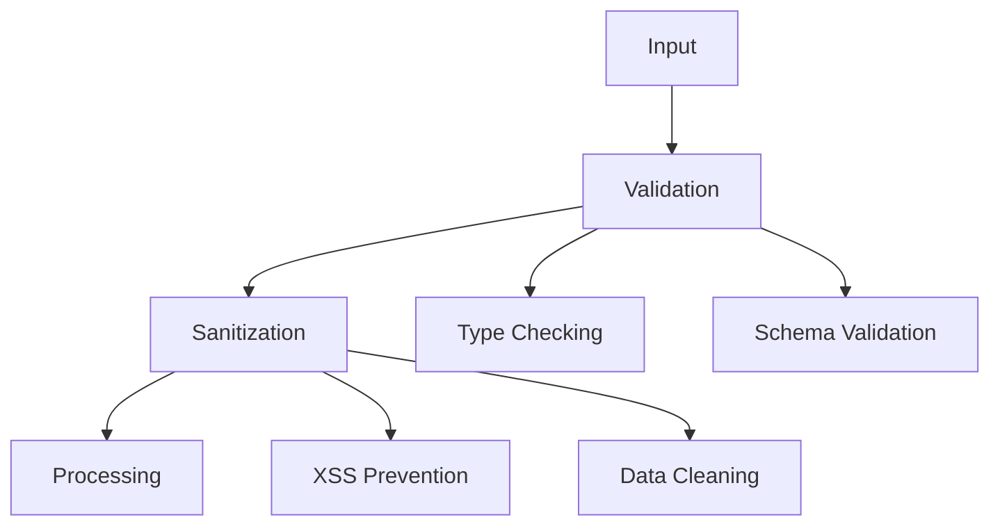

### Export Security

```mermaid
graph TD
    A[Export] --> B[File Types]
    A --> C[Data Access]
    
    B --> B1[Allowed Types]
    B --> B2[Size Limits]
    
    C --> C1[Authentication]
    C --> C2[Authorization]
