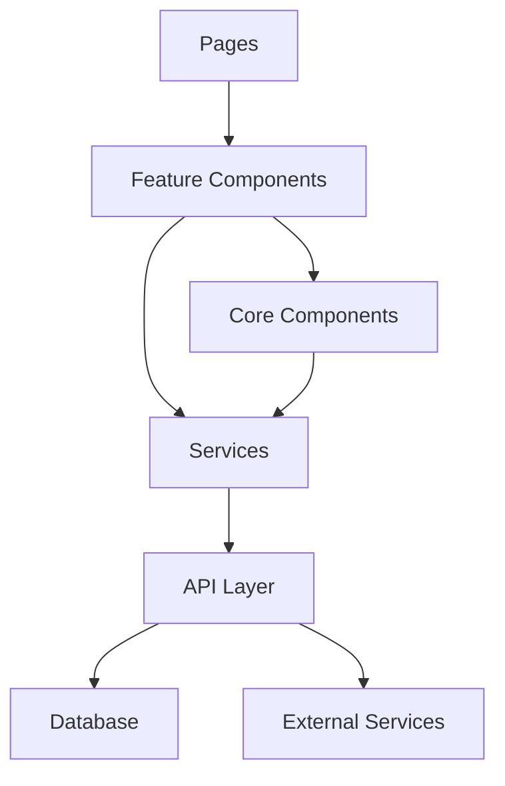
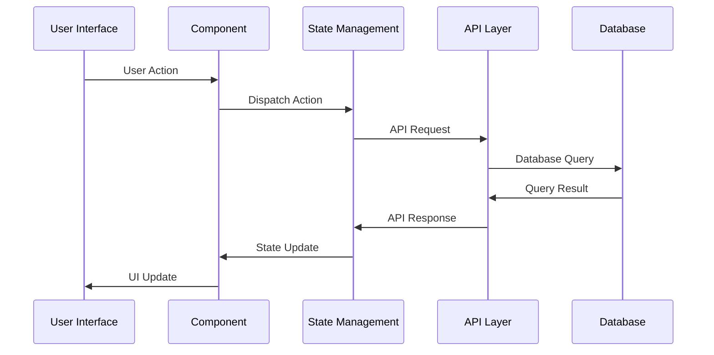

# System Architecture Guide - Part 2: Component Interactions & Data Flow

## Component Interaction Patterns

### 1. Service Communication

```typescript
// src/types/services.ts
interface ServiceCommunication {
  // Inter-service communication patterns
  patterns: {
    requestResponse: RequestResponsePattern;
    eventDriven: EventDrivenPattern;
    messageQueue: MessageQueuePattern;
  };
  
  // Communication protocols
  protocols: {
    http: HttpProtocol;
    websocket: WebSocketProtocol;
    grpc: GrpcProtocol;
  };
}

interface RequestResponsePattern {
  request: ServiceRequest;
  response: ServiceResponse;
  error: ServiceError;
  timeout: number;
}
```

### 2. Component Dependencies



## Detailed Data Flow Patterns

### 1. State Management Implementation

```typescript
// src/core/state/implementation.ts
interface StateImplementation {
  // State containers
  containers: {
    global: GlobalStateContainer;
    feature: FeatureStateContainer;
    ui: UIStateContainer;
  };
  
  // State updates
  updates: {
    sync: SyncStateUpdate;
    async: AsyncStateUpdate;
    batch: BatchStateUpdate;
  };
  
  // State subscriptions
  subscriptions: {
    listeners: StateChangeListener[];
    filters: StateChangeFilter[];
    middleware: StateMiddleware[];
  };
}
```

### 2. Data Flow Sequence



## Service Integration Patterns

### 1. API Integration

```typescript
// src/core/api/integration.ts
interface ApiIntegration {
  // Request handling
  request: {
    preparation: RequestPreparation;
    validation: RequestValidation;
    transformation: RequestTransformation;
  };
  
  // Response handling
  response: {
    parsing: ResponseParsing;
    caching: ResponseCaching;
    error: ErrorHandling;
  };
  
  // Integration patterns
  patterns: {
    retry: RetryPattern;
    circuit: CircuitBreaker;
    fallback: FallbackStrategy;
  };
}
```

### 2. Service Layer Implementation

```typescript
// src/services/implementation.ts
interface ServiceLayer {
  // Core services
  core: {
    auth: AuthService;
    data: DataService;
    cache: CacheService;
  };
  
  // Feature services
  features: {
    inspection: InspectionService;
    reporting: ReportingService;
    analytics: AnalyticsService;
  };
  
  // Utility services
  utils: {
    logger: LoggerService;
    metrics: MetricsService;
    config: ConfigService;
  };
}
```

## State Synchronization

### 1. Client-Server Sync

```typescript
// src/core/sync/types.ts
interface StateSync {
  // Sync strategies
  strategies: {
    optimistic: OptimisticSync;
    pessimistic: PessimisticSync;
    hybrid: HybridSync;
  };
  
  // Conflict resolution
  conflicts: {
    detection: ConflictDetection;
    resolution: ConflictResolution;
    prevention: ConflictPrevention;
  };
  
  // Sync operations
  operations: {
    push: PushOperation;
    pull: PullOperation;
    merge: MergeOperation;
  };
}
```

### 2. Real-time Updates

```typescript
// src/core/realtime/types.ts
interface RealtimeUpdates {
  // Connection handling
  connection: {
    establish: ConnectionEstablishment;
    maintain: ConnectionMaintenance;
    recover: ConnectionRecovery;
  };
  
  // Data handling
  data: {
    subscribe: DataSubscription;
    publish: DataPublication;
    filter: DataFilter;
  };
  
  // Event handling
  events: {
    system: SystemEvents;
    business: BusinessEvents;
    error: ErrorEvents;
  };
}
```

## Error Handling Patterns

### 1. Error Propagation

```typescript
// src/core/error/types.ts
interface ErrorHandling {
  // Error types
  types: {
    validation: ValidationError;
    business: BusinessError;
    technical: TechnicalError;
  };
  
  // Error handling strategies
  strategies: {
    retry: RetryStrategy;
    fallback: FallbackStrategy;
    recovery: RecoveryStrategy;
  };
  
  // Error reporting
  reporting: {
    logging: ErrorLogging;
    monitoring: ErrorMonitoring;
    notification: ErrorNotification;
  };
}
```

### 2. Recovery Patterns

```typescript
// src/core/recovery/types.ts
interface RecoveryPatterns {
  // Recovery strategies
  strategies: {
    immediate: ImmediateRecovery;
    gradual: GradualRecovery;
    manual: ManualRecovery;
  };
  
  // State recovery
  state: {
    snapshot: StateSnapshot;
    rollback: StateRollback;
    forward: StateForward;
  };
  
  // System recovery
  system: {
    restart: SystemRestart;
    failover: SystemFailover;
    backup: SystemBackup;
  };
}
```

## Implementation Guidelines

1. **Service Integration**
   - Implement consistent error handling
   - Use appropriate retry strategies
   - Implement proper timeout handling
   - Consider circuit breaker patterns

2. **State Management**
   - Implement proper state isolation
   - Use appropriate caching strategies
   - Consider optimistic updates
   - Implement proper loading states

3. **Error Handling**
   - Implement proper error boundaries
   - Use appropriate error reporting
   - Implement recovery strategies
   - Consider graceful degradation

4. **Performance**
   - Implement proper caching
   - Use appropriate loading strategies
   - Consider code splitting
   - Implement proper monitoring
