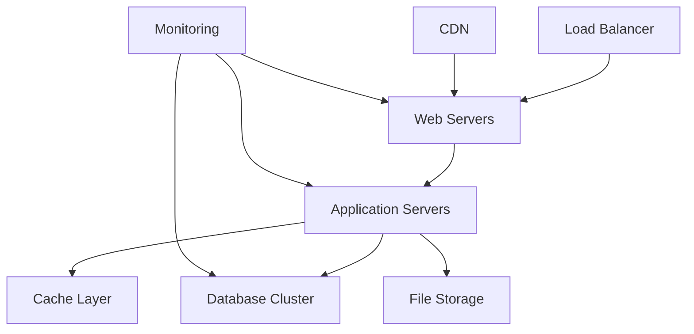

# System Architecture Guide - Part 3: Implementation, Security & Deployment

## Security Architecture

### 1. Authentication System

```typescript
// src/security/auth/types.ts
interface AuthenticationSystem {
  // Authentication methods
  methods: {
    jwt: JWTAuthentication;
    oauth: OAuthAuthentication;
    apiKey: APIKeyAuthentication;
  };
  
  // Session management
  sessions: {
    creation: SessionCreation;
    validation: SessionValidation;
    termination: SessionTermination;
  };
  
  // Token management
  tokens: {
    generation: TokenGeneration;
    validation: TokenValidation;
    refresh: TokenRefresh;
  };
}
```

### 2. Authorization Framework

```typescript
// src/security/authz/types.ts
interface AuthorizationFramework {
  // Access control
  access: {
    rbac: RoleBasedAccess;
    abac: AttributeBasedAccess;
    mac: MandatoryAccessControl;
  };
  
  // Permission management
  permissions: {
    roles: RoleDefinition[];
    policies: PolicyDefinition[];
    rules: AccessRule[];
  };
  
  // Resource protection
  resources: {
    api: ApiResourceProtection;
    files: FileResourceProtection;
    data: DataResourceProtection;
  };
}
```

## Deployment Architecture

### 1. Infrastructure Setup



### 2. Container Architecture

```yaml
# docker-compose.yml structure
services:
  frontend:
    build: ./frontend
    ports:
      - "3000:3000"
    environment:
      - NODE_ENV=production
      - API_URL=http://api:8000

  api:
    build: ./api
    ports:
      - "8000:8000"
    environment:
      - DATABASE_URL=postgres://user:pass@db:5432/dbname
      - REDIS_URL=redis://cache:6379

  db:
    image: postgres:latest
    volumes:
      - db_data:/var/lib/postgresql/data

  cache:
    image: redis:latest
    volumes:
      - cache_data:/data
```

## Implementation Details

### 1. Code Organization

```plaintext
src/
├── api/
│   ├── controllers/
│   ├── middleware/
│   ├── routes/
│   └── validators/
├── components/
│   ├── common/
│   ├── features/
│   └── layouts/
├── config/
│   ├── app.ts
│   ├── auth.ts
│   └── database.ts
├── core/
│   ├── services/
│   ├── state/
│   └── utils/
├── security/
│   ├── auth/
│   └── encryption/
└── types/
    ├── api.ts
    ├── components.ts
    └── security.ts
```

### 2. Implementation Patterns

```typescript
// src/core/patterns/types.ts
interface ImplementationPatterns {
  // Design patterns
  patterns: {
    singleton: SingletonPattern;
    factory: FactoryPattern;
    observer: ObserverPattern;
  };
  
  // Architectural patterns
  architecture: {
    mvc: MVCPattern;
    mvvm: MVVMPattern;
    clean: CleanArchitecture;
  };
  
  // Integration patterns
  integration: {
    adapter: AdapterPattern;
    facade: FacadePattern;
    proxy: ProxyPattern;
  };
}
```

## Security Implementation

### 1. Data Protection

```typescript
// src/security/data/types.ts
interface DataProtection {
  // Encryption
  encryption: {
    symmetric: SymmetricEncryption;
    asymmetric: AsymmetricEncryption;
    hashing: HashingMethods;
  };
  
  // Data masking
  masking: {
    pii: PIIMasking;
    financial: FinancialMasking;
    custom: CustomMasking;
  };
  
  // Access control
  access: {
    policies: AccessPolicy[];
    enforcement: AccessEnforcement;
    audit: AccessAudit;
  };
}
```

### 2. Security Monitoring

```typescript
// src/security/monitoring/types.ts
interface SecurityMonitoring {
  // Threat detection
  detection: {
    intrusion: IntrusionDetection;
    anomaly: AnomalyDetection;
    malware: MalwareDetection;
  };
  
  // Incident response
  response: {
    alerting: AlertSystem;
    mitigation: ThreatMitigation;
    recovery: SystemRecovery;
  };
  
  // Audit logging
  audit: {
    events: AuditEvent[];
    trails: AuditTrail[];
    reports: AuditReport[];
  };
}
```

## Monitoring & Logging

### 1. Application Monitoring

```typescript
// src/monitoring/app/types.ts
interface ApplicationMonitoring {
  // Performance monitoring
  performance: {
    metrics: PerformanceMetrics;
    tracing: DistributedTracing;
    profiling: ApplicationProfiling;
  };
  
  // Health monitoring
  health: {
    checks: HealthCheck[];
    status: SystemStatus;
    alerts: HealthAlert[];
  };
  
  // Resource monitoring
  resources: {
    cpu: CPUMonitoring;
    memory: MemoryMonitoring;
    disk: DiskMonitoring;
  };
}
```

### 2. Logging System

```typescript
// src/monitoring/logging/types.ts
interface LoggingSystem {
  // Log levels
  levels: {
    debug: DebugLogging;
    info: InfoLogging;
    error: ErrorLogging;
  };
  
  // Log storage
  storage: {
    local: LocalStorage;
    remote: RemoteStorage;
    archive: LogArchive;
  };
  
  // Log analysis
  analysis: {
    parsing: LogParsing;
    aggregation: LogAggregation;
    visualization: LogVisualization;
  };
}
```

## Deployment Guidelines

1. **Environment Setup**
   - Configure environment variables
   - Set up secrets management
   - Configure logging and monitoring
   - Set up backup systems

2. **Deployment Process**
   - Implement CI/CD pipelines
   - Configure automated testing
   - Set up deployment validation
   - Implement rollback procedures

3. **Scaling Strategy**
   - Implement horizontal scaling
   - Configure load balancing
   - Set up auto-scaling
   - Implement caching strategy

4. **Maintenance Procedures**
   - Schedule regular updates
   - Plan backup procedures
   - Document recovery processes
   - Monitor system health

## Security Guidelines

1. **Authentication**
   - Implement secure password policies
   - Use multi-factor authentication
   - Implement session management
   - Secure token handling

2. **Authorization**
   - Implement role-based access
   - Use principle of least privilege
   - Implement access controls
   - Regular permission audits

3. **Data Protection**
   - Encrypt sensitive data
   - Implement data masking
   - Secure data transmission
   - Regular security audits

4. **Monitoring**
   - Implement security monitoring
   - Set up intrusion detection
   - Configure alert systems
   - Regular security reviews
