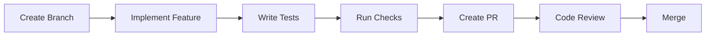

# Development Setup Guide - Part 3: Development Workflow

## Development Process

### 1. Feature Development Workflow



### 2. Git Workflow

```bash
# Start new feature
git checkout develop
git pull origin develop
git checkout -b feature/your-feature-name

# Regular commits
git add .
git commit -m "feat: your commit message"

# Push changes
git push origin feature/your-feature-name

# Update from develop
git fetch origin develop
git rebase origin/develop
```

## Code Review Process

### 1. Pull Request Guidelines

```markdown
# Pull Request Template
## Description
[Describe the changes made and why]

## Type of Change
- [ ] Bug fix
- [ ] New feature
- [ ] Breaking change
- [ ] Documentation update

## Checklist
- [ ] Tests added/updated
- [ ] Documentation updated
- [ ] Code follows style guidelines
- [ ] All checks passing
```

### 2. Review Checklist

```markdown
# Code Review Checklist
## Code Quality
- [ ] Follows coding standards
- [ ] No code smells
- [ ] Proper error handling
- [ ] Adequate logging

## Testing
- [ ] Unit tests pass
- [ ] Integration tests pass
- [ ] Edge cases covered
- [ ] Performance impact considered
```

## Testing Practices

### 1. Unit Testing

```typescript
// Example unit test
describe('UserService', () => {
  it('should create user with valid data', async () => {
    const userData = {
      name: 'Test User',
      email: 'test@example.com'
    };
    
    const user = await userService.create(userData);
    expect(user).toMatchObject(userData);
  });
  
  it('should throw error with invalid data', async () => {
    const invalidData = {
      name: '',
      email: 'invalid-email'
    };
    
    await expect(
      userService.create(invalidData)
    ).rejects.toThrow();
  });
});
```

### 2. Integration Testing

```typescript
// Example integration test
describe('Authentication Flow', () => {
  it('should complete login process', async () => {
    // Setup
    const user = await createTestUser();
    
    // Login
    const response = await request(app)
      .post('/api/auth/login')
      .send({
        email: user.email,
        password: 'password123'
      });
    
    // Verify
    expect(response.status).toBe(200);
    expect(response.body).toHaveProperty('token');
  });
});
```

## Debugging Tools

### 1. Browser DevTools

```typescript
// Debug logging
const debug = {
  log: (...args: any[]) => {
    if (process.env.NODE_ENV === 'development') {
      console.log('[DEBUG]', ...args);
    }
  },
  error: (...args: any[]) => {
    if (process.env.NODE_ENV === 'development') {
      console.error('[ERROR]', ...args);
    }
  }
};
```

### 2. VS Code Debug Configuration

```json
// .vscode/launch.json
{
  "version": "0.2.0",
  "configurations": [
    {
      "type": "node",
      "request": "launch",
      "name": "Debug Next.js",
      "runtimeExecutable": "npm",
      "runtimeArgs": ["run", "dev"],
      "port": 9229,
      "console": "integratedTerminal"
    },
    {
      "type": "node",
      "request": "launch",
      "name": "Debug Tests",
      "program": "${workspaceFolder}/node_modules/jest/bin/jest",
      "args": ["--runInBand"],
      "console": "integratedTerminal"
    }
  ]
}
```

## Performance Optimization

### 1. Code Optimization

```typescript
// Example performance optimization
const optimizePerformance = {
  // Memoization
  memoize: <T>(fn: (...args: any[]) => T) => {
    const cache = new Map();
    return (...args: any[]) => {
      const key = JSON.stringify(args);
      if (cache.has(key)) return cache.get(key);
      const result = fn(...args);
      cache.set(key, result);
      return result;
    };
  },
  
  // Debounce
  debounce: (fn: Function, delay: number) => {
    let timeoutId: NodeJS.Timeout;
    return (...args: any[]) => {
      clearTimeout(timeoutId);
      timeoutId = setTimeout(() => fn(...args), delay);
    };
  },
  
  // Throttle
  throttle: (fn: Function, limit: number) => {
    let inThrottle: boolean;
    return (...args: any[]) => {
      if (!inThrottle) {
        fn(...args);
        inThrottle = true;
        setTimeout(() => inThrottle = false, limit);
      }
    };
  }
};
```

### 2. Build Optimization

```javascript
// next.config.js optimization
module.exports = {
  // Optimize images
  images: {
    domains: ['your-domain.com'],
    deviceSizes: [640, 750, 828, 1080, 1200],
    imageSizes: [16, 32, 48, 64, 96],
    minimumCacheTTL: 60
  },
  
  // Enable SWC minification
  swcMinify: true,
  
  // Configure webpack
  webpack: (config, { dev, isServer }) => {
    // Optimize packages
    config.resolve.alias = {
      ...config.resolve.alias,
      'lodash-es': 'lodash'
    };
    
    // Add compression
    if (!dev && !isServer) {
      config.optimization.minimize = true;
    }
    
    return config;
  }
};
```

## Monitoring & Error Tracking

### 1. Error Handling

```typescript
// Global error handler
const errorHandler = {
  // Capture errors
  capture: (error: Error) => {
    // Log error
    console.error('[Error]', {
      message: error.message,
      stack: error.stack,
      timestamp: new Date().toISOString()
    });
    
    // Report to monitoring service
    if (process.env.NODE_ENV === 'production') {
      // Send to error tracking service
      errorTrackingService.report(error);
    }
  },
  
  // Handle API errors
  handleApiError: (error: any) => {
    return {
      status: error.status || 500,
      message: error.message || 'Internal Server Error',
      code: error.code || 'UNKNOWN_ERROR'
    };
  }
};
```

### 2. Performance Monitoring

```typescript
// Performance monitoring
const performanceMonitor = {
  // Track page load
  trackPageLoad: () => {
    if (typeof window !== 'undefined') {
      const timing = window.performance.timing;
      const loadTime = timing.loadEventEnd - timing.navigationStart;
      
      // Report metrics
      metrics.report('page_load', {
        duration: loadTime,
        path: window.location.pathname
      });
    }
  },
  
  // Track API calls
  trackApiCall: async (fn: Function) => {
    const start = Date.now();
    try {
      const result = await fn();
      const duration = Date.now() - start;
      
      // Report success
      metrics.report('api_call', {
        duration,
        status: 'success'
      });
      
      return result;
    } catch (error) {
      const duration = Date.now() - start;
      
      // Report failure
      metrics.report('api_call', {
        duration,
        status: 'error',
        error: error.message
      });
      
      throw error;
    }
  }
};
```

## Development Guidelines

1. **Code Quality**
   - Follow TypeScript best practices
   - Use ESLint and Prettier
   - Write comprehensive tests
   - Document code properly

2. **Performance**
   - Optimize bundle size
   - Implement caching strategies
   - Use code splitting
   - Monitor performance metrics

3. **Security**
   - Follow security best practices
   - Implement proper authentication
   - Validate all inputs
   - Use security headers

4. **Maintenance**
   - Keep dependencies updated
   - Monitor error rates
   - Review performance regularly
   - Document technical debt
