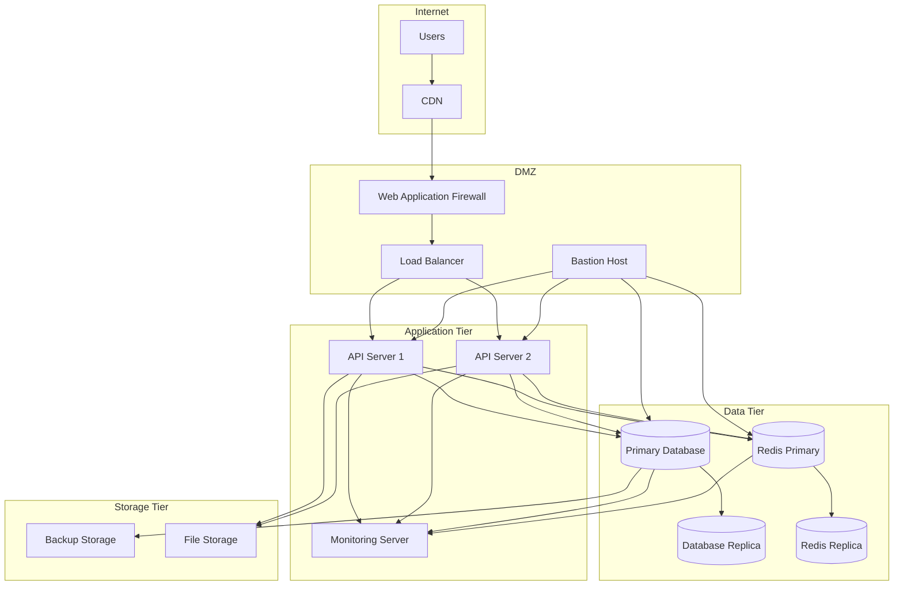

# Network Architecture

## Overview Diagram



## Network Configuration

### VPC Configuration
```hcl
VPC CIDR: 10.0.0.0/16

Subnets:
- DMZ: 10.0.1.0/24
- Application: 10.0.2.0/24
- Data: 10.0.3.0/24
- Storage: 10.0.4.0/24
- Monitoring: 10.0.5.0/24
```

### Security Groups

#### Load Balancer
```hcl
Inbound:
- 80/tcp from WAF
- 443/tcp from WAF

Outbound:
- 3000/tcp to Application Tier
```

#### Application Servers
```hcl
Inbound:
- 3000/tcp from Load Balancer
- 22/tcp from Bastion
- 9100/tcp from Monitoring

Outbound:
- 5432/tcp to Database
- 6379/tcp to Redis
- 9090/tcp to Monitoring
```

#### Database Servers
```hcl
Inbound:
- 5432/tcp from Application Tier
- 22/tcp from Bastion
- 9100/tcp from Monitoring

Outbound:
- 5432/tcp to Replica
```

#### Redis Servers
```hcl
Inbound:
- 6379/tcp from Application Tier
- 22/tcp from Bastion
- 9100/tcp from Monitoring

Outbound:
- 6379/tcp to Replica
```

#### Monitoring Server
```hcl
Inbound:
- 3000/tcp from Internal Network (Grafana)
- 9090/tcp from Internal Network (Prometheus)
- 9093/tcp from Internal Network (Alertmanager)
- 22/tcp from Bastion

Outbound:
- All ports to monitored instances
```

### DNS Configuration

#### Internal DNS
```yaml
api-1.internal: 10.0.2.10
api-2.internal: 10.0.2.11
db-primary.internal: 10.0.3.10
db-replica.internal: 10.0.3.11
redis-primary.internal: 10.0.3.20
redis-replica.internal: 10.0.3.21
monitoring.internal: 10.0.5.10
```

#### External DNS
```yaml
api.yourdomain.com: Load Balancer IP
monitoring.yourdomain.com: Load Balancer IP (restricted)
```

### Load Balancer Configuration

#### Health Checks
```yaml
Path: /health
Interval: 30s
Timeout: 5s
Healthy threshold: 2
Unhealthy threshold: 3
```

#### SSL Configuration
```yaml
Certificate: *.yourdomain.com
SSL Policy: Modern compatibility
HTTP to HTTPS redirect: Yes
HSTS: Enabled
```

### Firewall Rules

#### Ingress Rules
```yaml
- Allow HTTPS (443) from Internet to WAF
- Allow HTTP (80) from Internet to WAF (redirect only)
- Allow SSH (22) from Office IP to Bastion
- Allow VPN from Office IP
```

#### Egress Rules
```yaml
- Allow HTTPS (443) to external services
- Allow DNS (53) to internal DNS
- Allow NTP (123) to time servers
```

### Network Monitoring

#### Metrics Collection
```yaml
- Network throughput
- Connection states
- Latency
- Packet loss
- DNS resolution time
- SSL certificate expiry
```

#### Alerts
```yaml
- High latency (>100ms)
- Connection failures
- Certificate expiration warning
- Network saturation (>80%)
```

### Backup Network
```yaml
Dedicated backup network: 10.0.6.0/24
Backup traffic isolation: Yes
Bandwidth throttling: 50% of available
```

### Emergency Access
```yaml
VPN Backup: Secondary VPN endpoint
Emergency IPs: Whitelist of emergency access IPs
Break-glass procedure: Documented in runbooks
```

## Network Security

### WAF Rules
```yaml
- SQL Injection protection
- XSS protection
- Rate limiting
- Geo-blocking
- Custom rules for application
```

### DDoS Protection
```yaml
- Layer 3/4 protection
- Layer 7 protection
- Traffic analysis
- Automatic mitigation
```

### SSL/TLS Configuration
```yaml
Minimum TLS version: 1.2
Preferred ciphers:
- TLS_AES_128_GCM_SHA256
- TLS_AES_256_GCM_SHA384
- TLS_CHACHA20_POLY1305_SHA256
```

### Network Monitoring
```yaml
- IDS/IPS
- Network flow logs
- Security group changes
- VPC flow logs
```

## Disaster Recovery

### Network Failover
```yaml
- Secondary VPC in standby
- DNS failover configuration
- Load balancer failover
- VPN backup links
```

### Backup Connectivity
```yaml
- Secondary Internet connection
- Alternative DNS servers
- Backup VPN endpoints
- Emergency access procedures
