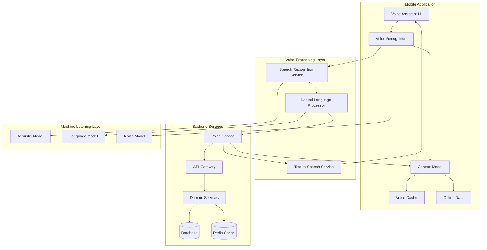

# Voice System Architecture

## System Overview



## Component Details

### Mobile Application Components

#### Voice Assistant UI
- Voice activation button
- Voice feedback display
- Command suggestions
- Status indicators
- Error messages

#### Voice Recognition
- Audio capture
- Noise filtering
- Voice activity detection
- Offline recognition capabilities

#### Command Manager
- Command parsing
- Intent mapping
- Action execution
- Response handling

#### Voice Cache
- Frequently used commands
- Voice patterns
- Response templates
- Command history

#### Offline Data
- Local command processing
- Cached responses
- Sync queue
- Temporary storage

### Voice Processing Components

#### Speech Recognition Service
```typescript
interface SpeechRecognitionService {
    recognize(audio: AudioStream): Promise<RecognitionResult>;
    adaptToUser(userId: string): Promise<void>;
    updateAcousticModel(data: TrainingData): Promise<void>;
    getRecognitionConfidence(): number;
}
```

#### Natural Language Processor
```typescript
interface NLPService {
    parseIntent(text: string): Promise<Intent>;
    extractEntities(text: string): Promise<Entity[]>;
    analyzeContext(text: string, context: Context): Promise<ContextualIntent>;
    learnFromInteraction(interaction: Interaction): Promise<void>;
}
```

#### Text-to-Speech Service
```typescript
interface TTSService {
    synthesize(text: string, voice: VoiceType): Promise<AudioStream>;
    adjustSpeed(factor: number): void;
    setPitch(level: number): void;
    useEmphasis(enabled: boolean): void;
}
```

#### Context Manager
```typescript
interface ContextManager {
    getCurrentContext(): Context;
    updateContext(context: Context): void;
    predictNextContext(): Context;
    getRelevantCommands(context: Context): Command[];
}
```

### Backend Integration

#### API Gateway
```typescript
interface VoiceAPIGateway {
    routeCommand(command: VoiceCommand): Promise<CommandResponse>;
    validateAuth(token: string): Promise<boolean>;
    logInteraction(interaction: VoiceInteraction): Promise<void>;
    getMetrics(): Promise<VoiceMetrics>;
}
```

#### Voice Service
```typescript
interface VoiceService {
    processCommand(command: ProcessedCommand): Promise<CommandResult>;
    updateUserProfile(userId: string, profile: VoiceProfile): Promise<void>;
    getCommandHistory(userId: string): Promise<CommandHistory>;
    optimizeForUser(userId: string): Promise<void>;
}
```

## Data Flow

### 1. Voice Input Flow
```sequence
Mobile App->Voice Recognition: Capture audio
Voice Recognition->Speech Recognition: Stream audio
Speech Recognition->NLP: Text
NLP->Voice Service: Structured command
Voice Service->Domain Services: Execute command
Domain Services->Mobile App: Command result
```

### 2. Context Update Flow
```sequence
Mobile App->Context Manager: Current state
Context Manager->NLP: Update context
NLP->Voice Service: Context-aware processing
Voice Service->Mobile App: Contextual response
```

### 3. Offline Operation Flow
```sequence
Mobile App->Voice Cache: Check cached commands
Voice Cache->Command Manager: Process locally
Command Manager->Offline Data: Store result
Offline Data->Mobile App: Sync when online
```

## Performance Considerations

### 1. Response Time Optimization
- Local command caching
- Predictive command loading
- Compressed audio transmission
- Parallel processing

### 2. Battery Usage
- Adaptive sampling rate
- Conditional noise filtering
- Batch processing
- Power-aware scheduling

### 3. Network Efficiency
- Command batching
- Delta updates
- Compressed transfers
- Priority queuing

## Security Measures

### 1. Voice Authentication
```typescript
interface VoiceAuth {
    verifyVoiceprint(audio: AudioStream): Promise<AuthResult>;
    updateVoiceProfile(profile: VoiceProfile): Promise<void>;
    checkPermissions(command: Command): Promise<boolean>;
    revokeAccess(userId: string): Promise<void>;
}
```

### 2. Data Protection
- Audio encryption
- Secure storage
- Access control
- Data retention

## Monitoring

### 1. Performance Metrics
```typescript
interface VoiceMetrics {
    recognitionAccuracy: number;
    responseTime: number;
    batteryImpact: number;
    networkUsage: number;
    commandSuccess: number;
}
```

### 2. Error Tracking
```typescript
interface ErrorTracking {
    logError(error: VoiceError): void;
    analyzePattern(timeRange: TimeRange): ErrorPattern;
    getErrorRate(): number;
    suggestImprovements(): Suggestion[];
}
```

## Deployment Configuration

### 1. Voice Processing Servers
```yaml
resources:
  cpu: 4 cores
  memory: 16GB
  storage: 100GB SSD
  network: 10Gbps

scaling:
  min_instances: 2
  max_instances: 10
  target_cpu_utilization: 70%
```

### 2. ML Model Deployment
```yaml
models:
  acoustic:
    version: 2.0
    update_frequency: weekly
    cache_size: 2GB
  language:
    version: 1.5
    update_frequency: daily
    cache_size: 1GB
